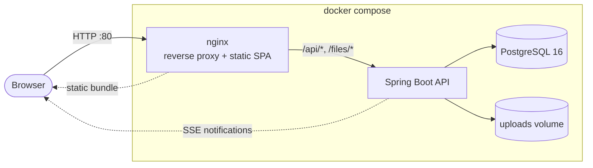
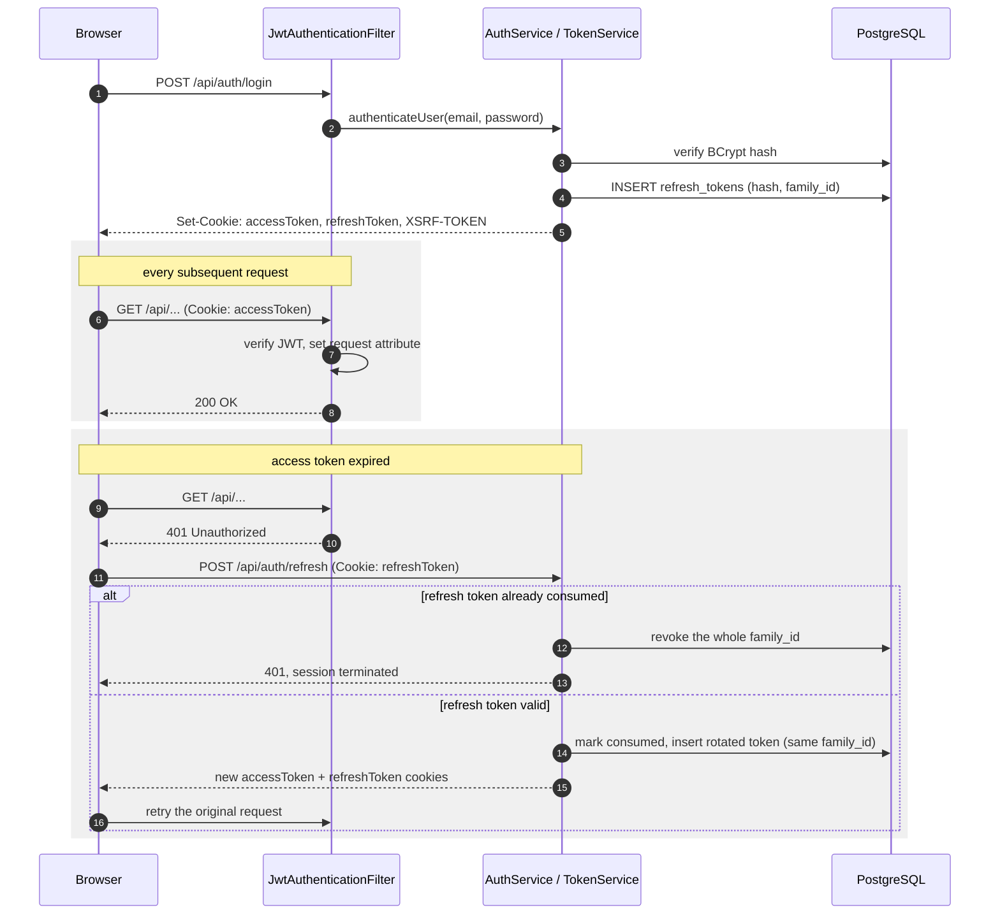
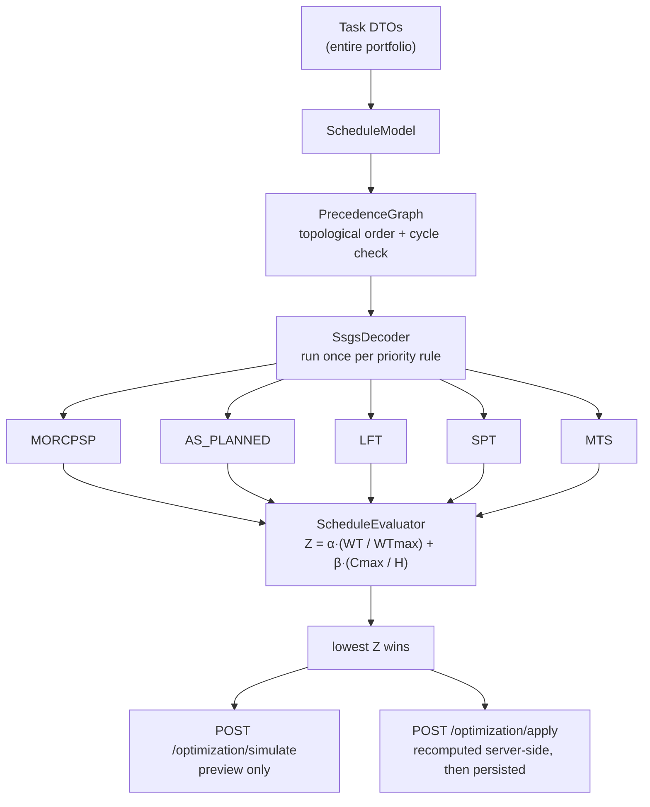
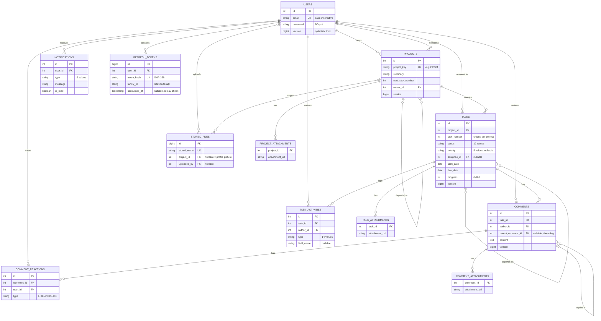

# FlowLink

FlowLink is a project and portfolio management application. It tracks projects, tasks and task
dependencies, renders them on a Gantt-style timeline, and adds threaded comments with reactions,
file attachments, real-time notifications and global search.

Its distinguishing feature is a **schedule optimizer**. Projects in a portfolio usually share the
same people, so plans drawn independently collide. The optimizer treats the portfolio as a
resource-constrained project scheduling problem — assignees are the renewable resources, task
dependencies are precedence constraints — and searches for a schedule that minimises a weighted
combination of priority-weighted tardiness and makespan. It runs as a simulation first, so the
proposed dates can be reviewed before anything is written.

- **Backend**: Spring Boot 3.5.12, Java 21, PostgreSQL 16, Flyway, Maven.
- **Frontend**: React 18.3 in TypeScript, TanStack Query v5, TailwindCSS, React Router 6, Axios,
  Chart.js, Tiptap, Formik + Yup. Built with Create React App (`react-scripts` 5).
- **Auth**: JWT in HTTP-only cookies — access token 15 min, refresh token 7 days rotated per use,
  double-submit CSRF, 30-day absolute session cap.

---

## Architecture



The browser only ever talks to nginx: it serves the built SPA directly and reverse-proxies
`/api/` and `/files/` to the backend, so there is exactly one origin from the browser's point of
view and nothing to configure for CORS in production. The backend is a single Spring Boot
process — there is no separate auth server, message queue or cache; sessions, rate limiting and
the SSE notification stream all live inside that one JVM. PostgreSQL is the only other moving
part.

There is also no Spring Security filter chain. The only Spring Security artifact on the classpath
is `spring-security-crypto`, used for `BCryptPasswordEncoder`; authentication, CSRF and rate
limiting are plain servlet filters in `filter/` (see [Repository layout](#repository-layout)), not
a security filter chain — do not expect method security such as `@PreAuthorize` to do anything
here.

## Quick start with Docker

This is the supported path. It builds both images, starts PostgreSQL, applies the database
migrations and publishes the site through nginx.

```bash
cp .env.example .env
```

Then edit `.env` and set the two variables that have no default:

```bash
# Signing key for JWT access tokens. Minimum 32 characters.
openssl rand -base64 48    # -> JWT_SECRET

# Password for the PostgreSQL role.
openssl rand -base64 24    # -> POSTGRES_PASSWORD
```

`JWT_SECRET` is **mandatory**. The backend binds it as a validated configuration property and
refuses to start without a value of at least 32 characters — there is no fallback default, by
design. `docker compose up` fails with a named error if either variable is missing.

For a plain-HTTP localhost stack, also set `COOKIE_SECURE=false` in `.env`. Auth cookies are marked
`Secure` by default, and a browser will not send a `Secure` cookie over `http://`, so logging in
appears to succeed and every subsequent request is unauthenticated.

```bash
docker compose up --build
```

The site is then on <http://localhost> (change the published port with `HTTP_PORT`). nginx serves
the built SPA and reverse-proxies `/api/` and `/files/` to the backend, so the browser only ever
talks to one origin.

The database port is deliberately not published. To attach `psql` or a GUI client for one session:

```bash
docker compose run --rm --publish 5432:5432 db
```

Useful operations:

```bash
docker compose logs -f backend      # follow backend logs
docker compose down                 # stop, keep the pgdata and uploads volumes
docker compose down -v              # stop and delete all data
```

---

## Local development

Two processes, plus a PostgreSQL you provide.

### Prerequisites

- **JDK 21.** The build targets Java 21, and the test suite does not run on a newer JDK: Mockito's
  bytecode instrumentation fails on JVMs it has no support for, and a machine whose default `java`
  is 24/25/26 will see the mock-based tests error out before asserting anything. Select 21
  explicitly rather than changing the machine default:

  ```bash
  # macOS
  export JAVA_HOME=$(/usr/libexec/java_home -v 21)

  # Linux with update-alternatives / SDKMAN
  export JAVA_HOME=/usr/lib/jvm/temurin-21-jdk    # or: sdk use java 21.0.5-tem
  ```

  Verify with `mvn -version`, which prints the JDK Maven actually runs on.
- **Node 20 or newer.**
- **Docker** running, if you want to run the backend integration tests (see below).
- **PostgreSQL 16** for the backend to talk to, unless you point `DATABASE_URL` at the compose
  database.

### Database

```bash
psql -U postgres -c 'CREATE DATABASE flowlink;'
```

Nothing further: Flyway creates every table on the first backend start. Do not hand-build the
schema — see [Database schema](#database-schema).

### Backend

```bash
cd backend
export JAVA_HOME=$(/usr/libexec/java_home -v 21)

export JWT_SECRET="$(openssl rand -base64 48)"   # mandatory
export DATABASE_PASSWORD=postgres                # if your local role needs one
export COOKIE_SECURE=false                       # required for http://localhost

mvn spring-boot:run
```

It listens on port 8080. Health check: <http://localhost:8080/actuator/health> (the only actuator
endpoint exposed).

### Frontend

```bash
cd frontend
npm install
npm start
```

It listens on port 3000 and calls `http://localhost:8080` by default (`REACT_APP_API_URL`). The
backend's default `CORS_ORIGIN` is `http://localhost:3000`, so the two agree out of the box. If you
run the dev server on another port, set `CORS_ORIGIN` to match exactly — scheme, host and port. A
credentialed CORS preflight does not accept wildcards, so a mismatch blocks every API call.

---

## Tests

### Backend

```bash
cd backend
export JAVA_HOME=$(/usr/libexec/java_home -v 21)

mvn test                                  # the whole suite
mvn test -Dtest=AuthServiceTest           # one class
mvn test -Dtest='*ServiceTest'            # a pattern
mvn test -Dtest=SchemaIntegrationTest -DfailIfNoSpecifiedTests=false
```

**Docker must be running.** The classes under `src/test/java/com/backend/integration/` extend
`PostgresIntegrationTest`, which starts a real `postgres:16-alpine` container through
Testcontainers. They exist because the schema depends on `timestamptz` handling, enum check
constraints and `ON DELETE` semantics that an in-memory database in PostgreSQL compatibility mode
does not enforce. One container is started per build and shared across the classes.

If your Docker is a drop-in replacement (Colima, Podman, Rancher Desktop), Testcontainers may need
help finding the socket, and its resource-reaper sidecar may not start at all:

```bash
export DOCKER_HOST=unix://$HOME/.colima/default/docker.sock
export TESTCONTAINERS_RYUK_DISABLED=true
```

### Frontend

```bash
cd frontend
npm test -- --watchAll=false             # CI mode, no watcher
npm test                                 # interactive watch mode
npm test -- --coverage --watchAll=false  # with coverage
npm run typecheck                        # tsc --noEmit, no test runner involved
npm run lint                             # eslint over src/
```

The test files live next to the code they cover, as `*.test.ts` under `src/util/`.

---

## Configuration

Every backend setting lives in `backend/src/main/resources/application.properties` and reads an
environment variable where it is meant to be overridden. There is no production profile file; the
defaults committed there are already the safe ones.

`.env.example` is the annotated template. Copy it to `.env`, which is gitignored and must never be
committed.

### Required

| Variable | Notes |
|---|---|
| `JWT_SECRET` | Signing key for JWT access tokens. Minimum 32 characters, validated at startup. No default — the application will not start without it. Generate one per environment and never reuse it. |
| `POSTGRES_PASSWORD` | Read by `docker-compose.yml` only. Sets the database role's password and is passed to the backend as `DATABASE_PASSWORD`. |

### Database

| Variable | Default | Notes |
|---|---|---|
| `DATABASE_URL` | `jdbc:postgresql://localhost:5432/flowlink` | Compose derives this from `POSTGRES_DB`. |
| `DATABASE_USER` | `postgres` | |
| `DATABASE_PASSWORD` | *(empty)* | |
| `HIKARI_MIN_IDLE` | `5` | Connection pool floor. |
| `HIKARI_MAX_POOL` | `20` | Connection pool ceiling. |

### HTTP, origins and cookies

| Variable | Default | Notes |
|---|---|---|
| `CORS_ORIGIN` | `http://localhost:3000` | Origin the browser loads the app from. Must match exactly; credentialed CORS rejects wildcards. |
| `FRONTEND_BASE_URL` | `http://localhost:3000` | Base URL used to build links inside outbound email. |
| `COOKIE_SECURE` | `true` | Auth cookies are `Secure` by default. Set `false` only for a plain-HTTP localhost stack. |
| `COOKIE_SAME_SITE` | `Lax` | `Lax`, `Strict` or `None`. `None` requires `COOKIE_SECURE=true`. |
| `SESSION_MAX_DAYS` | `30` | Absolute lifetime of a login, enforced regardless of refresh-token rotation. |
| `INTERNAL_PROXIES` | RFC1918 ranges + loopback | Regex of reverse proxies whose `X-Forwarded-*` headers are trusted. See below. |

`server.forward-headers-strategy=NATIVE` plus `server.tomcat.remoteip.internal-proxies` is how the
real client address reaches the rate limiter: Tomcat's RemoteIp valve rewrites `getRemoteAddr()`
from `X-Forwarded-For`, but only when the immediate peer matches the internal-proxies pattern.
Widen `INTERNAL_PROXIES` only if your load balancer sits on a public address, and never to a
pattern that matches arbitrary clients — a client able to spoof its own address defeats the rate
limiter entirely.

### Storage and uploads

| Variable | Default | Notes |
|---|---|---|
| `UPLOAD_DIR` | `uploads` | Filesystem directory for attachments and profile pictures. In compose this is a named volume mounted at `/app/uploads`. |

Uploaded files are **not** static assets. Nothing serves `UPLOAD_DIR` over HTTP — neither nginx nor
the backend maps `/uploads/...`; it is only the on-disk directory name. The public route is
`GET /files/{name}` (`FileController`), which requires a valid JWT *and* access to the project the
file belongs to: `stored_files` records which project each upload is scoped to, and `AccessGuard`
is consulted before any bytes are streamed. A file with no ownership row is refused rather than
trusted, which is what makes it safe for an hourly `ScheduledMaintenance` sweep to delete
unreferenced uploads older than six hours — a row-less file on disk is an orphan, never a
legitimate attachment still in use. Responses are always sent with
`Content-Disposition: attachment` and `X-Content-Type-Options: nosniff`, so an uploaded document
can never be rendered inline in the app's own origin. Uploads themselves use
`multipart/form-data`, a JSON metadata part plus the file parts.

### Rate limiting

Per client address per window, except login, which is additionally scoped per account.

| Variable | Default |
|---|---|
| `RATE_LIMIT_WINDOW_MS` | `900000` (15 min) |
| `RATE_LIMIT_LOGIN` | `5` |
| `RATE_LIMIT_REGISTER` | `3` |
| `RATE_LIMIT_WRITE` | `300` |
| `RATE_LIMIT_OPTIMIZE` | `30` |
| `RATE_LIMIT_SEARCH` | `120` |
| `RATE_LIMIT_INVITATION` | `50` |

### API docs

| Variable | Default | Notes |
|---|---|---|
| `API_DOCS_ENABLED` | `true` | Gates Swagger UI and the raw OpenAPI JSON (`/swagger-ui/*`, `/v3/api-docs*`), both reachable without an access token. Recommended `false` in production. |

### Schedule optimizer

| Variable | Default | Notes |
|---|---|---|
| `OPT_ALPHA` | `0.8` | Weight of the normalised priority-weighted tardiness term. |
| `OPT_BETA` | `0.2` | Weight of the normalised makespan term. |

### Outbound mail (optional, off by default)

With mail disabled, project invitations still arrive as in-app notifications.

| Variable | Default |
|---|---|
| `APP_MAIL_ENABLED` | `false` |
| `MAIL_FROM` | `noreply@example.com` |
| `MAIL_HOST` | `smtp-relay.brevo.com` |
| `MAIL_PORT` | `587` |
| `MAIL_USERNAME` | *(empty)* |
| `MAIL_PASSWORD` | *(empty)* |

### Compose and frontend build

| Variable | Default | Notes |
|---|---|---|
| `POSTGRES_DB` | `flowlink` | Compose only. |
| `POSTGRES_USER` | `postgres` | Compose only. |
| `HTTP_PORT` | `80` | Host port the site is published on. |
| `REACT_APP_API_URL` | `http://localhost:8080` | Baked into the bundle at build time. The compose build passes an **empty string** on purpose, so the app issues same-origin relative requests that nginx proxies. An absolute URL here hard-codes a hostname into the JavaScript and bypasses the proxy. |

---

## Authentication

JWTs live in HTTP-only cookies rather than local storage, so they are invisible to JavaScript and
immune to token-stealing XSS. A short-lived access token authenticates requests; a long-lived
refresh token, rotated on every use, keeps the session alive without asking for a password again.
Login sets three cookies: `accessToken` (HttpOnly, 15 min), `refreshToken` (HttpOnly, 7 days) and
`XSRF-TOKEN` (script-readable, so the frontend can echo it into the CSRF header).



On the frontend, an Axios response interceptor is what drives the refresh step in the diagram
above: it catches the 401, calls `/api/auth/refresh` exactly once even if several requests fail
concurrently — the concurrent failures are queued behind that single in-flight refresh and
replayed once it resolves, rather than each firing its own refresh — and retries the original
request. It skips this dance for `/api/auth/login`, `/api/auth/refresh` and `/api/auth/logout`,
where refreshing first would be pointless or actively wrong.

Refresh tokens are never stored in plaintext: only a SHA-256 hash of 256 bits of `SecureRandom`
output is persisted, so a stolen database backup does not also hand over every live session. Every
token descended from one login shares a `family_id`. Presenting an already-consumed refresh
token — the signature of a stolen token being replayed — revokes every token in that family
rather than just the one presented, so a single compromised cookie cannot be reused even if the
legitimate client refreshes first. `app.session.absolute-max-days` caps a session regardless of
how many times it has been rotated. CSRF is handled separately, by double-submit: the
`XSRF-TOKEN` cookie value must be echoed back in an `X-CSRF-Token` header on every unsafe method,
which a cross-site request cannot do without reading the cookie itself.

---

## Public vs protected endpoints

`config/PublicEndpoints` is the whole policy, deny-by-default. Matching is exact on the raw
request URI, which is fail-closed: an encoding trick makes a path *less* likely to match an
exemption, never more. The one exception is the API docs subtree (`/swagger-ui/*`,
`/v3/api-docs*`), which is a deliberate prefix match.

Reachable without an access token:

- `POST /api/users` (registration — the path is exempt for POST only; reading or updating the
  current user still requires a token)
- `POST /api/auth/login`
- `POST /api/auth/refresh`
- `/error`
- `/actuator/health`
- `/swagger-ui/*`, `/v3/api-docs*`

Everything else requires a valid access token. Exempt from the CSRF check: `POST /api/auth/login`,
`POST /api/users`, `/error`, `/actuator/health`. `/api/auth/refresh` is deliberately *not*
exempt — the client already sends the CSRF header on it, so leaving it out of the exemption list
means a future relaxation of `COOKIE_SAME_SITE` to `None` would not silently open a hole.

---

## Notification system

`NotificationService` creates notifications asynchronously for project invitations, project
updates and member removal (`ProjectService`); task assignment, task updates including date
changes, and task deletion (`TaskService`); and new comments, replies and reactions on a task
(`CommentService`). There is **no mention parsing** anywhere in the codebase — comments are not
scanned for `@name`.

Delivery is a Server-Sent Events stream at `GET /api/notifications/stream`, managed by
`SseEmitterManager` and capped at `app.sse.max-emitters-per-user` (default `4`) concurrent streams
per user, so a reconnect loop cannot accumulate them without bound. `GET
/api/notifications/unread-count` and a manual refresh cover the case where the stream is down.

---

## Schedule optimizer

Projects in a portfolio usually share the same people, so plans drawn up independently collide —
the same engineer assigned to overlapping work in two projects at once. The optimizer treats the
whole portfolio as one resource-constrained project scheduling problem: assignees are the
renewable resources, task dependencies are precedence constraints, and it searches for a schedule
that resolves the conflicts.



`SsgsDecoder` is a serial schedule generation scheme: at every step it takes the
highest-priority eligible task — one whose predecessors are all already placed — and puts it at
the earliest day that satisfies its release date, its predecessors' finish times and its
assignee's availability. Because a task is only ever considered once every predecessor is final,
the result is precedence-feasible by construction, with no repair pass needed. The decoder runs
once under each of five priority rules (`MORCPSP`, the composite priority-and-fan-out rule that
gives the algorithm its name, plus four textbook baselines), and `ScheduleEvaluator` scores every
candidate against a single objective: a weighted combination of priority-weighted tardiness and
makespan, both normalised to `[0, 1]` so portfolios of different sizes stay comparable. The
lowest-scoring candidate wins.

`POST /optimization/simulate` runs this whole pipeline and returns the proposed dates without
writing anything, which is what lets the UI show them as ghost bars alongside the current plan
before anyone commits to them. `POST /optimization/apply` does not trust dates echoed back by the
browser — it recomputes the schedule server-side from the current data and persists that, so
what ends up in the database is feasible by construction rather than whatever the client last
saw.

Every reported metric — on-time count, weighted delay and schedule span — is measured over the
work the optimizer actually controls. Completed and withdrawn tasks, and cross-project anchors,
bound the timeline and constrain their successors, but are not scored: including them made the
makespan term saturate so the `beta` weight stopped telling candidate schedules apart.

`CriticalPathAnalyzer` runs a forward and backward pass over the same precedence graph to compute
each task's total float — the slack the timeline and dashboard use to flag what is critical. Float
is slack against the work's **own** deadlines: a task's latest acceptable finish is the earlier of
its due date and the latest start its successors can tolerate, so a task is critical when nothing
is left between where it can start and where it must (`slack <= 0`). Deriving the finish from the
schedule's own longest path instead — the textbook formulation for a network with a single
unknown deadline — gave every task without a parallel alternative zero float, which on a board of
chains and independent tasks meant all of them. Completed and withdrawn work, and cross-project
anchors, still constrain their successors but are neither scored nor reported.

---

## Database schema

Flyway owns the schema. The migrations are in
`backend/src/main/resources/db/migration/` (`V1` … `V9`) and run automatically on startup, in
development, in CI and in production alike.

Hibernate is set to `spring.jpa.hibernate.ddl-auto=validate`: it verifies that the entity model
matches the migrated schema and never mutates it. A drifted entity fails the application at
startup instead of silently altering a production table.



`project_members`, `project_dependencies` and `task_dependencies` are plain join tables backing
the many-to-many edges above; the three `*_attachments` tables are Hibernate element collections
(just a foreign key and a URL, no id of their own) rather than entities in their own right.

Consequences worth knowing:

- **Never hand-edit the schema.** Add a new `V{n}__description.sql` file instead.
- **Never edit an applied migration.** Flyway records a checksum per version and refuses to start
  if one changes.
- `spring.flyway.baseline-on-migrate=true` with `baseline-version=1` lets Flyway adopt a database
  that predates it (one built by the old auto-DDL) by treating its state as `V1`.

Migration highlights, useful when reading the entities: `V2` made `refresh_tokens.user_id` a real
foreign key; `V3` gave every foreign key an explicit `ON DELETE` action, added the missing
join-table primary keys, made email identity case-insensitive, and added
`projects.created`/`updated` (`NOT NULL`) and `users.version`; `V4` renamed `refresh_tokens.token`
to `token_hash` and added `family_id`/`family_started_at`/`consumed_at`; `V5` added
`stored_files`; `V6` backfilled `users.version` for rows that predate `V3` and made the column
`NOT NULL`; `V7` dropped the redundant case-sensitive unique constraint on `users.email` from
`V1`, since `V3`'s case-insensitive `uk_users_email_lower` already subsumes it; `V8` indexed the
three foreign-key referencing columns `V3` and `V5` missed (`task_activities.author_id`,
`comment_reactions.user_id`, `stored_files.uploaded_by`), since PostgreSQL creates no index for
them and a delete on the parent scans the child without one; `V9` backfilled `stored_files` for
every attachment and profile picture predating `V5`, since a file with no ownership row is now
refused rather than served and the unreferenced-upload sweep would otherwise delete it.

### Key entities

- **User** — owns projects, is a member of projects, is assigned tasks, receives notifications.
  Optimistically locked (`version`).
- **Project** — has an owner, members, tasks, a unique `projectKey`, `nextTaskNumber` for
  allocating task numbers, attachments, and other projects as dependencies. Optimistically locked.
- **Task** — belongs to a project, has one assignee, comments, activities, attachments, other
  tasks as dependencies, status, priority, progress, start/due dates. Identified in the API by
  `{projectKey}-{taskNumber}`. Optimistically locked.
- **Comment** — belongs to a task, has an author, an optional parent comment (threading),
  reactions and attachments. Optimistically locked.
- **Notification** — belongs to a user, carries a type and a link. Not optimistically locked.
- **RefreshToken** — hash, family id, family start, consumption timestamp. Not optimistically
  locked.
- **StoredFile** — maps an uploaded filename to the project and uploader it belongs to. Not
  optimistically locked.

## Demo data

`backend/scripts/db/demo-seed.sql` loads a realistic portfolio — four accounts, three projects,
45 tasks with dependencies and deliberate resource conflicts — for demos and manual testing. See
`backend/scripts/db/DEMO-SEED-README.md`. It is idempotent — it clears its own data before
inserting — and it must never contain DDL, since Flyway alone owns the schema.

## Repository layout

```
backend/
  src/main/java/com/backend/
    config/         @ConfigurationProperties, CORS, async and scheduling setup
    controllers/    REST endpoints
    dtos/           API response shapes
    entities/       JPA entities
    exception/      custom exceptions + GlobalExceptionHandler
    filter/         servlet filters: security headers, rate limit, JWT, CSRF
    mapper/         entity -> DTO conversion
    repositories/   Spring Data JPA
    requests/       request payload records
    scheduling/     the schedule optimizer (SSGS decoder, objective, critical path)
    security/       access guards
    services/       business logic
    util/           validation and small helpers
    web/            cookies, paging, argument resolvers
  src/main/resources/db/migration/   Flyway migrations
  scripts/db/                        demo seed data
frontend/
  src/components/   React components by area
  src/context/      AuthContext, ProjectsContext, NotificationsContext, ThemeContext
  src/hooks/        custom hooks
  src/pages/        route-level containers
  src/util/api.ts   the single HTTP boundary
docker-compose.yml
```

Nearly every frontend source file is `.ts`/`.tsx`. The two deliberate exceptions are
`setupTests.js` (Jest environment shims) and `react-app-env.d.ts`; do not add new plain `.js`
files.

### Backend packages

- **config/** — `@ConfigurationProperties` classes (`AppProperties` for everything under `app.*`,
  `JwtProperties`, `CookieProperties`), plus `WebConfig` (CORS + argument resolvers), `AsyncConfig`,
  `SchedulingConfig`, `JwtConfig`, `PasswordEncoderConfig`, `OpenApiConfig` (hides the
  `@CurrentUserId` parameter from the generated OpenAPI docs, in both the parameter list and
  multipart request bodies), and `PublicEndpoints` — the deny-by-default authentication/CSRF
  policy in one place (see [Public vs protected endpoints](#public-vs-protected-endpoints)).
- **controllers/** — REST endpoints, one per resource: Auth, User, Project, Task, TaskActivity,
  Comment, Notification, Search, Optimization, File.
- **services/** — business logic. Includes `SseEmitterManager` (notification streams),
  `RateLimitService`, `EmailService`, `ScheduledMaintenance` (the hourly refresh-token cleanup and
  unreferenced-upload sweep), `OptimizationService` + `OptimizationInputLoader`.
- **repositories/** — Spring Data JPA.
- **entities/** — JPA entities: `User`, `Project`, `Task`, `Comment`, `CommentReaction`,
  `Notification`, `TaskActivity`, `RefreshToken`, `StoredFile`, plus the enums.
- **dtos/** — API response shapes, including the `PagedResponse` envelope and `ApiError`.
- **requests/** — request payload records: `LoginRequest`, `UserRegistrationRequest`,
  `ProjectRequest`, `TaskRequest`, `TaskScheduleRequest`, `OptimizationRequest`,
  `ApplyOptimizationRequest`, `UpdateProfileRequest`, `EmailPreferencesRequest`.
- **mapper/** — `EntityMapper`, entity → DTO conversion.
- **security/** — `AccessGuard`, the single place that answers "may this user touch this project /
  task / comment".
- **scheduling/** — the extracted scheduling domain: `SchedulingService`, `ScheduleModel`,
  `PrecedenceGraph`, `SsgsDecoder`, `PriorityRule`, `ScheduleObjective`, `ScheduleEvaluator`,
  `CriticalPathAnalyzer`, plus the value types the decoder works in — `ScheduleTask` (a task on a
  pure integer day axis, no entities or dates), `Placement` and `Schedule` (where the decoder put
  each task), `ScheduleMetrics` (the scored result) — and `SchedulingSupport` (shared day
  arithmetic). Free of entities and non-transactional: it consumes DTOs and returns a value, so
  CPU-bound work does not hold a pooled database connection.
- **web/** — HTTP plumbing: `CookieFactory`, `@CurrentUserId` + its argument resolver,
  `PageRequests`, `RequestValidator`, `FilterResponseUtil`.
- **filter/** — servlet filters, ordered:
  1. `SecurityHeadersFilter` (`HIGHEST_PRECEDENCE`)
  2. `RateLimitFilter` (+1)
  3. `JwtAuthenticationFilter` (+2)
  4. `CsrfProtectionFilter` (+3)
- **exception/** — custom exceptions (`AuthorizationException`, `FileStorageException`,
  `ResourceNotFoundException`, `TooManyAttemptsException`, `UnauthenticatedException`,
  `ValidationException`) and `GlobalExceptionHandler`.
- **util/** — `ValidationUtil`, `AfterCommit`, `FileValidationConstants`, `SecureTokens` (the one
  generator for opaque URL-safe secrets), `GraphCycles` (the shared cycle-detection walk used for
  project/task dependency validation), `HtmlSanitizer` (jsoup-based sanitisation for comment
  bodies and rich-text task/project descriptions).

There is no `events/` package; deferred side effects (mail, file unlinking, SSE pushes) go through
`util/AfterCommit`, which registers a transaction synchronization so nothing escapes before commit.

### Frontend structure

- **pages/** — route-level containers: `AuthPage`, `DashboardPage`, `ProjectsPage`. The last two
  are `React.lazy`-loaded from `App.tsx`.
- **components/** — grouped by area: `auth`, `comments`, `common` (incl. the `RichTextEditor`
  subsystem), `dashboard`, `layout`, `modals`, `projects`.
- **context/** — four providers, each with a `useX()` hook: `AuthContext` (current user + logout),
  `ProjectsContext`, `NotificationsContext`, `ThemeContext` (dark mode). All four keep the raw
  context unexported so consumers cannot bypass the hook's provider guard.
- **hooks/** — data enrichment, filtering, stats, modal/form state, timeline viewport and resize,
  `useComments`, `useScheduleOptimization`.
- **util/api.ts** — the single HTTP boundary. Typed Axios client with CSRF header injection and
  automatic refresh on 401 (see [Authentication](#authentication)).
- **util/** — pure helpers: dates, status/priority config, error/toast helpers, project/task
  utilities, `statsCompute`, `scheduleAnalysis`.
- **config/index.ts** — `API_BASE_URL` from `REACT_APP_API_URL` (checked against `undefined`, not
  truthiness, because the container build passes an empty string on purpose), request timeout,
  debounce delay.
- **types.ts** — the domain types every API function is declared against.

### State management

Server state is owned by **TanStack Query** (`QueryClient` created in `App.tsx`). The contexts are
thin façades over it, not hand-rolled stores:

- `ProjectsContext` runs a `useQuery` on `['projects']` and exposes project/task CRUD. Mutations
  invalidate the query rather than patching local state; `retryProjects()` forces a fetch for a
  user-initiated retry.
- `NotificationsContext` holds the notification list and unread count in local state fed by the
  Server-Sent Events stream, with exponential-backoff reconnect. Notification types that mean the
  board changed additionally invalidate the projects query (debounced).
- `AuthContext` holds the current user in `useState`; there is no server query behind it. The user
  is resolved once at startup in `App.tsx` via `checkUserAuth()`.
- `ThemeContext` holds dark mode.
- Comment API access lives in the `useComments` hook, not a context.

## License

MIT. See [LICENSE](LICENSE).
